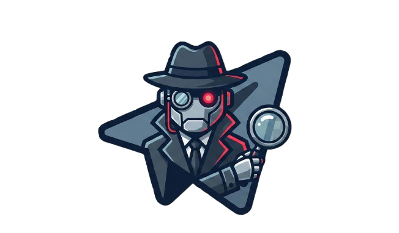

<p align="center">
  
</p>

#  BotScape


**Botscape** es una plataforma modular de Threat Intelligence diseñada para monitorizar y perfilar campañas de ciberdelincuencia que utilizan la API de Telegram como infraestructura de Comando y Control (C2).

---

## 🎓 Origen del Proyecto

Este proyecto nace como trabajo de investigación aplicada dentro del **GSEC (Google Safety Engineering Center)**, específicamente para la **VII Edición del Diploma de Experto en Ingeniería Inversa e Inteligencia Malware**. Un seminario acerca del "Seguimiento de Actores y Métodos de Exfiltración", impartido por Jose Luis Sánchez, fue el motivo por el que se comenzó a desarrollar esta idea.

---

## ⚖️ Disclaimer (Aviso Legal)

> **⚠️ ADVERTENCIA:**
>
> Esta herramienta ha sido desarrollada **exclusivamente con fines académicos, de investigación y defensivos**. Su propósito es ayudar a analistas de inteligencia y equipos de Blue Team a comprender las TTPs (Tácticas, Técnicas y Procedimientos) de los adversarios.
>
> El autor **no se hace responsable** del uso indebido, malicioso o ilegal que se pueda dar al código aquí expuesto. La interceptación de comunicaciones privadas sin autorización es un delito en muchas jurisdicciones. Asegúrate de operar esta herramienta únicamente en entornos controlados, sobre infraestructura autorizada o analizando botnets públicas ya identificadas como maliciosas.

---

## 🚀 Capacidades Principales

* **📡 Interceptación en Tiempo Real:** Ingesta masiva de mensajes de los bots monitorizados.
* **🕸️ Grafo de Trazabilidad:** Correlación visual de infraestructura. Detecta conexiones ocultas entre Bots, Hashes de Malware, Chats y Operadores.
* **🧠 Profiler AI:** Clasificación automática de la intención del bot (Stealer vs. Drainer vs. Support) utilizando modelos LLM locales.
* **🛡️ Breach Monitor:** Panel defensivo para monitorizar activos VIP (Dominios corporativos, Emails) en el flujo de datos exfiltrados.
* **🌍 Network Intelligence:** Geolocalización de infraestructura C2.
* **🎯 Hunter Automatizado:** Búsqueda proactiva de nuevas muestras de malware en VirusTotal para extraer y monitorizar nuevos tokens de bots.

---

## 🛠️ Arquitectura de Alto Nivel

El sistema sigue una arquitectura de microservicios contenerizados:

1. **Listener Service:** Cliente asíncrono (Telethon) que intercepta y normaliza mensajes.
2. **Intelligence Engine:** Pipeline de enriquecimiento (Hunter, Network Profiler, Similarity Engine).
3. **Storage Layer:** PostgreSQL con esquema relacional.
4. **Dashboard:** Interfaz analítica basada en Streamlit.

Para ver el diagrama detallado de componentes y flujos de datos, consulta la [Documentación de Arquitectura](https://letee2.github.io/Botscape/report.html).

---

## ⚡ Quick Start

La forma más rápida y segura de desplegar Botscape es utilizando el script de instalación automática y Docker Compose.

### Requisitos previos

* Docker y Docker Compose instalados.
* Python 3.10+
* Una cuenta de Telegram (para obtener `API_ID` y `API_HASH`).
* (Opcional) Una API Key de VirusTotal para el módulo *Hunter*.

### 1. Clonar el repositorio
```bash
git clone https://github.com/Letee2/Botscape.git
cd Botscape
```

### 2. Configuración Automática

Hemos incluido un script interactivo que preparará todo el entorno por ti. Este script te solicitará tus credenciales de API y configurará la conexión segura a la base de datos.
```bash
python easy_install.py
```

**¿Qué hace este script?**

* Genera el archivo `.env` con tus secretos.
* Configura las credenciales de PostgreSQL.
* Prepara las carpetas de volúmenes para persistencia (`/media`, `/sessions`).
* Levanta (opcionalmente) los contenedores.


### 3. Acceso al Dashboard

Una vez que los contenedores estén activos, el panel de control estará disponible en tu navegador local (o en la IP de tu servidor), una vez 
ejecutes: 

```bash
streamlit run botscape/dashboard/Home.py
```

---

## 📚 Documentación

Para una comprensión profunda de cada módulo, decisiones de diseño y guías de uso, se ha  generado una documentación técnica detallada en formato HTML incluida en este repositorio.

Puedes empezar explorando:

* 📄 Portada y Visión General
* ⚙️ Listener Engine
* 📊 Dashboard Architecture
* 📄 Report sobre un Cluster a través de BotScape
